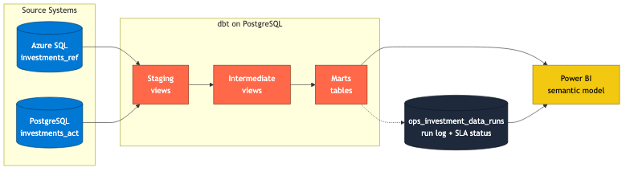

<div align="center">

<picture>
  <source media="(prefers-color-scheme: dark)" srcset="assets/nh-logo-dark.svg" width="80">
  <source media="(prefers-color-scheme: light)" srcset="assets/nh-logo-light.svg" width="80">
  
</picture>

# Investment Data Product

**Governed investment dataset with a published data contract, dbt-modeled marts, and blocking DQ gates feeding a Power BI consumer layer**

[](DATA_CONTRACT.md)
[](#architecture)
[](LICENSE)


</div>

---

### What This Does

A governed investment data product built with PostgreSQL source systems (simulating Azure SQL + PostgreSQL), modeled in dbt, and delivered to a Power BI consumer layer. The platform standardizes security, issuer, benchmark, position, and transaction data into contract-driven marts with blocking data quality gates, SLA monitoring, and stewardship-ready exception reporting.

---

### Architecture



Reference data (securities, issuers, benchmark membership, prices) originates in the Azure SQL simulation (`investments_ref`). Activity data (accounts, positions, transactions) originates in the PostgreSQL activity system (`investments_act`). dbt staging views present source-conformed 1:1 projections with a `_source_loaded_at` lineage column. Intermediate views apply Type 2 effective dating, resolve issuer hierarchy, and enrich facts with the governed `security_key` via CUSIP. Marts land as tables in the silver layer and are the contract surface Power BI reads. The `ops_investment_data_runs` table carries dataset-level SLA status and run health for the consumer health tile.

---

### Design Principles

1. The data carries its own health signals. Consumers do not need to check external dashboards to know if the data is trustworthy.
2. Business logic lives at the data layer, not in reports. Reports stay thin, governed, and consistent.
3. The data product has an owner, an SLA, a consumer list, and a published contract. Anything less is a script.
4. SLA is a dataset-level property, not a row-level attribute. Run outcomes live in a separate ops table, never on the fact.
5. Breaking changes require consumer notification, not just a commit.

---

### Operational Visibility

Dataset-level health lives in `investments.silver.ops_investment_data_runs`:

| Column | Purpose |
|---|---|
|  | Unique identifier for the pipeline run |
|  | UTC timestamp of the run |
|  | Mart name being logged (e.g. `fact_position`) |
|  | Source row count at run time |
|  | Curated row count produced by the run |
|  | Absolute drift between source and curated |
|  |  /  /  |
|  | Overall DQ outcome |
|  | Populated when `checks_passed = false` |

This is the audit trail and the source of the health tile a Power BI semantic model reads.

---

### Blocking DQ Gates

Every run of the DQ suite enforces these checks. Any failure fails the workflow and blocks publication of the entire suite, so cross-table joins always read a consistent vintage.

| Gate | Check | Severity |
|---|---|---|
|  | Zero nulls in `cusip` and `isin` on `dim_security`; CUSIP and ISIN check-digit algorithms pass for every row |  |
|  | Zero nulls in `lei` on `dim_issuer` |  |
|  | `transaction_id` unique across `fact_transaction`; `(account_key, security_key, as_of_date)` unique across `fact_position`; no overlapping effective periods for the same key in `dim_security`, `dim_issuer`, or `fact_benchmark_constituent` |  |
|  | Survivorship: every `security_key` referenced in historical `fact_position` or `fact_transaction` exists in `dim_security` |  |
|  | Market value coherence: `abs(market_value - quantity * price) / abs(market_value)` within 1% for every `fact_position` row |  |
|  | Issuer hierarchy integrity: every non-null `parent_issuer_key` resolves to an effective-dated parent row; no cycles |  |
|  | Benchmark weight completeness: `sum(weight_pct)` within 100% +/- 0.1% per `(benchmark_key, effective period)` |  |
|  | Position-to-transaction tie-out: signed `quantity` from `fact_transaction` between two position snapshots reconciles to the `fact_position` quantity delta within 0.5 shares |  |
|  | Source-to-curated row count drift within 1% per product |  |
|  | Each product meets its freshness SLA stated in the Refresh & SLA table in the data contract |  |

Referential integrity between facts and dimensions is enforced at build time via inner joins on the effective-dated dimension row, not as a runtime gate.

---

### SLA Status Logic

| Freshness Lag | Status |
|---|---|
| `max(as_of_date) >= current_date - 2` |  |
| `current_date - 3` to `current_date - 5` |  |
| older than `current_date - 5` |  |

`RED` blocks the run. `AMBER` passes with a warning logged to the runs table. Benchmark constituents use a relaxed window (`current_date - 35`) because the published cadence is monthly plus event-driven.

---

### Repo Layout

```
.
├── sources/
│   ├── azure_sql/ddl/                        # Reference system DDL (dim_issuer, dim_security, benchmark, price)
│   ├── postgresql/ddl/                       # Activity system DDL (account, position, transaction)
│   └── seed_data/generate_seeds.py           # S&P 500 scrape + synthetic CUSIP/ISIN/LEI generator
├── dbt/
│   ├── dbt_project.yml
│   ├── profiles.yml                          # gitignored; local postgres connection
│   ├── models/
│   │   ├── staging/                          # 1:1 source-conformed views + sources.yml
│   │   ├── intermediate/                     # Type 2 versioning + hierarchy + fact enrichment
│   │   └── marts/                            # dim_security, dim_issuer, dim_date, dim_benchmark,
│   │                                         # fact_position, fact_transaction, fact_benchmark_constituent,
│   │                                         # ops_investment_data_runs, schema.yml
│   ├── tests/                                # Custom singular tests (coherence, grain, survivorship, etc.)
│   └── macros/
├── contracts/                                # Contract source of truth + machine-readable copies
├── consumer/
│   └── powerbi/                              # Semantic model, measures, report assets
├── docs/
│   ├── architecture.mmd                      # Mermaid source
│   └── architecture.png                      # Rendered diagram
├── assets/                                   # Branding (nh-logo SVGs)
├── DATA_CONTRACT.md                          # Ownership, SLA, schema, exclusions
├── CHANGELOG.md                              # Versioned changes
├── LICENSE                                   # MIT
└── README.md
```

---

### Running

**1. Local PostgreSQL.** Provision a local PostgreSQL 15+ instance with trust authentication for user `nickhidalgo` and create the `investment_data` database:

```bash
createdb -U nickhidalgo investment_data
```

**2. Apply source DDL.** Create the three schemas and all source tables:

```bash
for f in sources/azure_sql/ddl/*.sql sources/postgresql/ddl/*.sql; do
  psql -U nickhidalgo -h localhost -d investment_data -v ON_ERROR_STOP=1 -f "$f"
done
```

**3. Generate seed data.** Scrapes S&P 500 constituents from Wikipedia, samples 50, generates synthetic identifiers and 252 trading days of prices, and loads positions and transactions across three accounts:

```bash
python3 sources/seed_data/generate_seeds.py
```

**4. Run dbt.** A local `dbt/profiles.yml` (gitignored) targets the same PostgreSQL database:

```bash
cd dbt
DBT_PROFILES_DIR="$PWD" dbt debug
DBT_PROFILES_DIR="$PWD" dbt run
DBT_PROFILES_DIR="$PWD" dbt test
```

`dbt run` materializes staging and intermediate as views and marts as tables into `investments_silver_staging`, `investments_silver_intermediate`, and `investments_silver_marts`. `dbt test` runs generic schema tests plus the custom singular tests that mirror the contract gates.

**5. Connect Power BI.** Point Power BI Desktop at the PostgreSQL connector (`localhost / investment_data`) and import the `investments_silver_marts` schema. The semantic model and measure set live in `consumer/powerbi/`.

---

### Tech Stack

| Component | Technology |
|---|---|
|  | Azure SQL Database (reference data, simulated in local PostgreSQL) |
|  | PostgreSQL (activity data) |
|  | dbt (staging, intermediate, marts) |
|  | Databricks (target production runtime, Unity Catalog, Delta Lake) |
|  | Delta Lake |
|  | Unity Catalog |
|  | dbt generic tests + custom singular tests for contract gates |
|  | `investments.silver.ops_investment_data_runs` incremental table |
|  | Power BI semantic model |
|  | Published data contract + CHANGELOG-tracked versioning |

---

### Ownership

Data Product Owner: Nicholas Hidalgo. See [`DATA_CONTRACT.md`](DATA_CONTRACT.md) for SLA, schema, semantics, and exclusion policy. See [`CHANGELOG.md`](CHANGELOG.md) for versioned changes.

---

<div align="center">

[](https://linkedin.com/in/nicholashidalgo)&nbsp;
[](https://nicholashidalgo.com)&nbsp;
[](mailto:analytics@nicholashidalgo.com)

</div>
